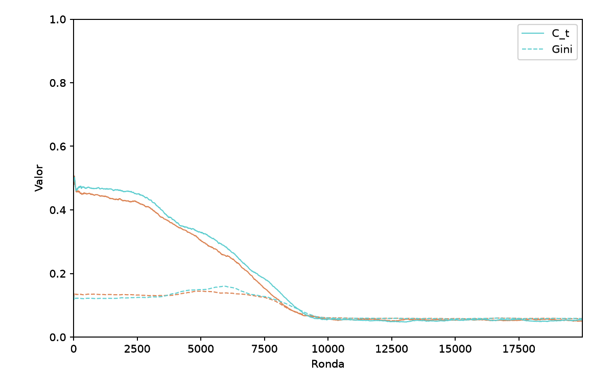
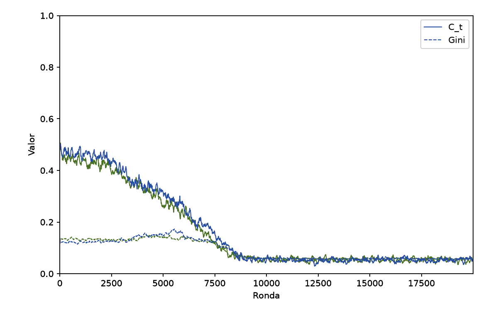
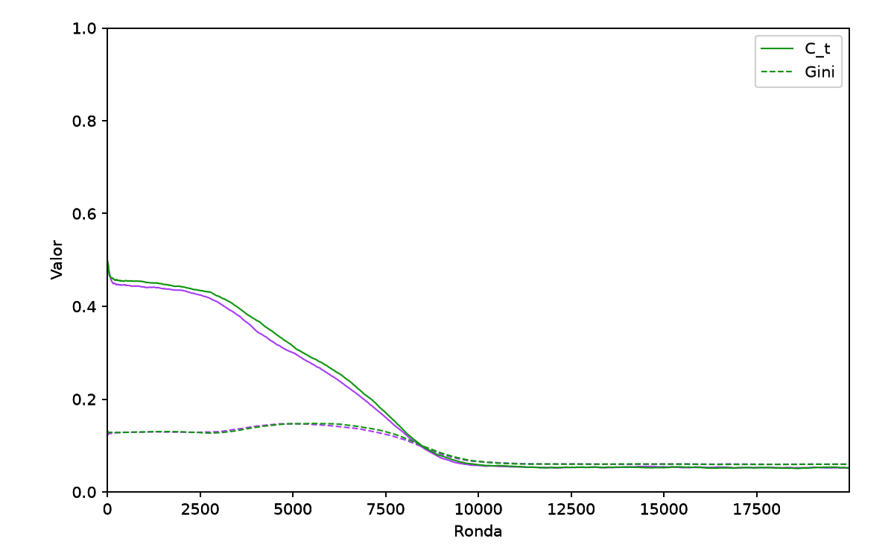
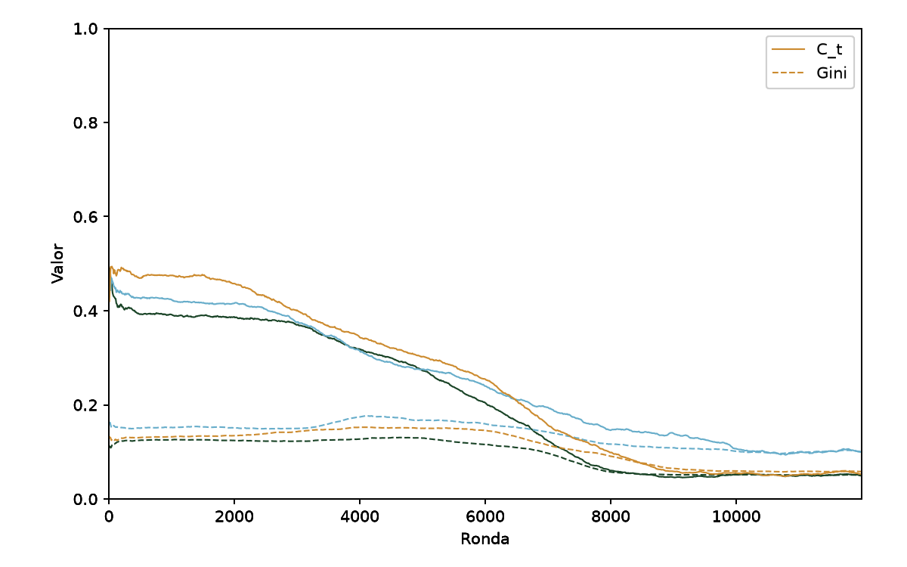
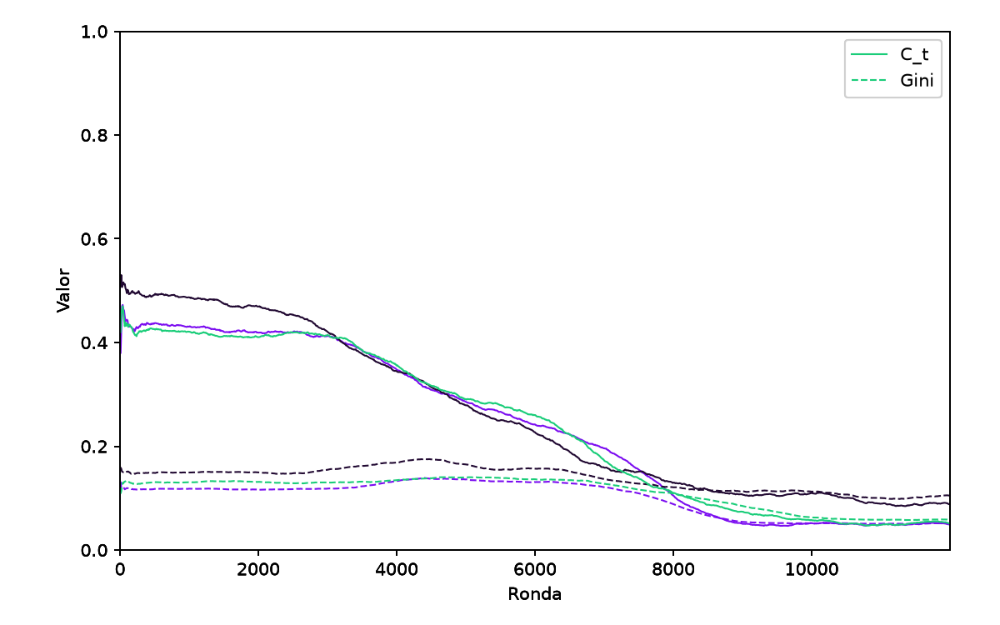
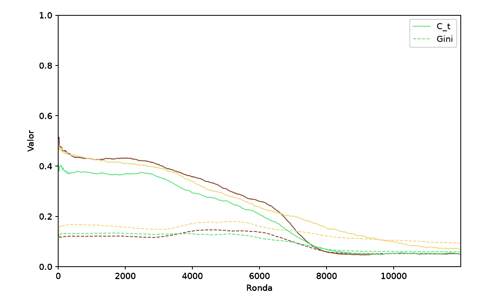
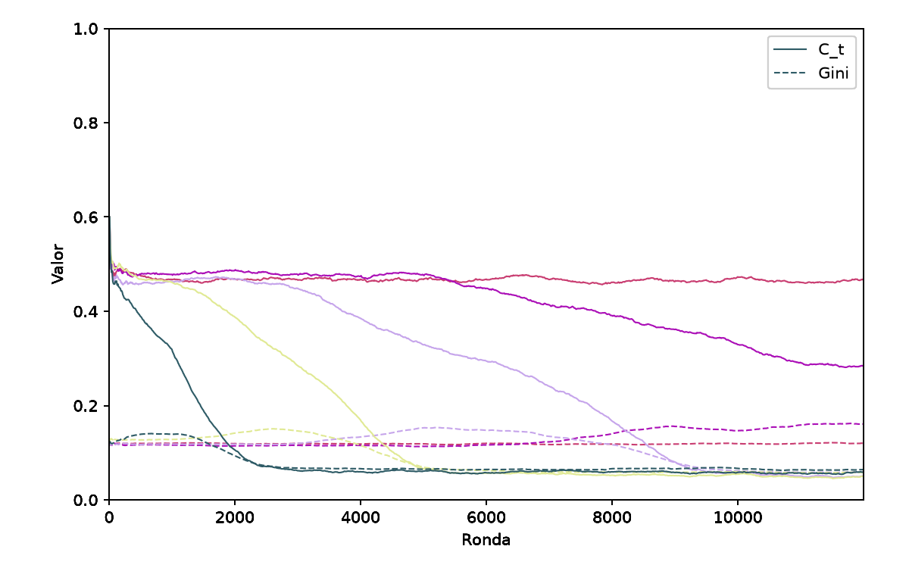
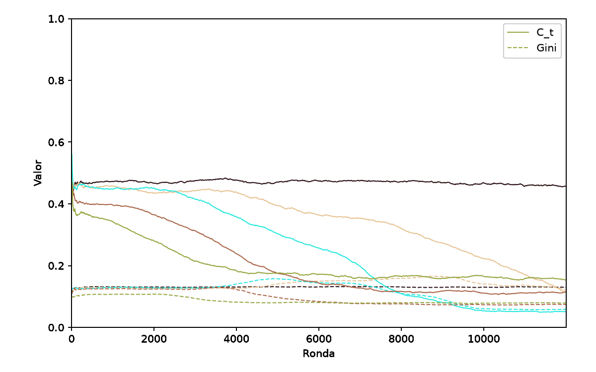
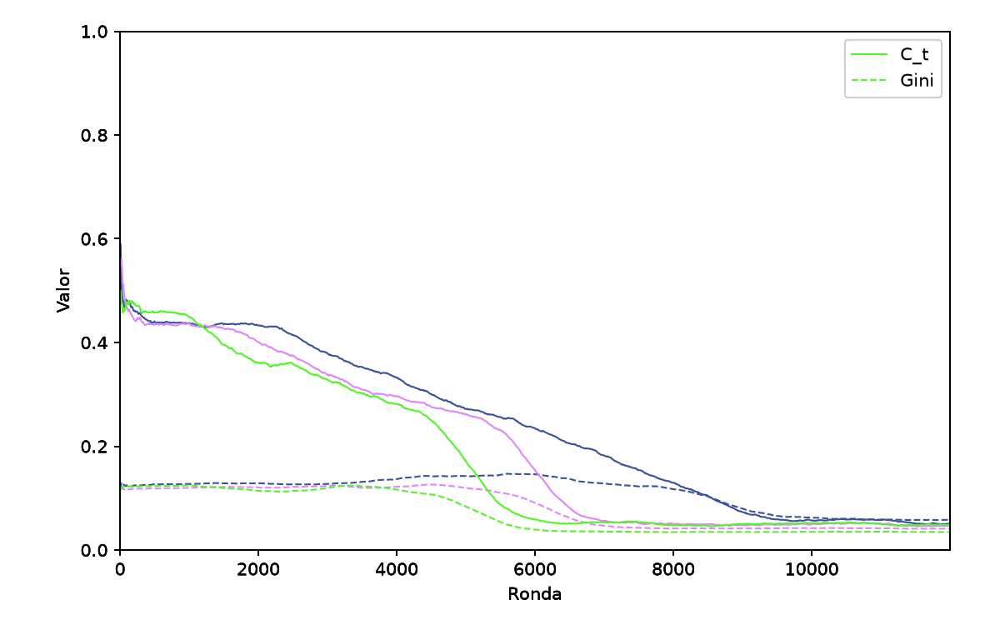

# QOOPERATE — Experimentos y conclusiones

Este documento resume los experimentos realizados sobre el framework QOOPERATE descrito en `README.md` y las
conclusiones obtenidas.

## Parámetros comunes

Salvo que se indique lo contrario en el parámetro correspondiente, todos los experimentos de este documento comparten:

| Parámetro            | Valor                                             |
|----------------------|---------------------------------------------------|
| `n_rounds`           | `12000` (salvo E0, que prueba `20000`)            |
| `n_agents`           | `100` (salvo E0, que también prueba `900`)        |
| `topology`           | `watts_strogatz` (salvo E1, que prueba las demás) |
| `k`                  | `8` (salvo E1, que lo varía)                      |
| `alpha`              | `0.1` (salvo E2, que lo varía)                    |
| `epsilon`            | `0.1` (salvo E3, que lo varía)                    |
| `rho`                | `1` (salvo EA2, que lo varía)                     |
| `gamma`              | `0.9`                                             |
| `reward_window`      | `10`                                              |
| `sample_every`       | `10`                                              |
| `coop_n_divisions`   | `2`                                               |
| `reward_n_divisions` | `2`                                               |
| `ws_beta`            | `0.1`                                             |

El último parámetro es `seed`, el cual no mostró comportamientos distintos entre corridas con una misma configuración.

## E0 — Validación y calibración

El objetivo de E0 fue verificar la estabilidad del simulador y determinar una duración de corrida adecuada. Se
compararon poblaciones de 100 y 900 agentes, utilizando dos semillas para cada tamaño.

Las curvas de cooperación y Gini fueron prácticamente indistinguibles entre tamaños de población y semillas. La
cooperación comenzó cerca de 0.5, correspondiente a la inicialización aleatoria, y descendió progresivamente hasta
estabilizarse alrededor de 0.05 cerca de la ronda 10000. El Gini mostró una dinámica similar entre corridas y también
alcanzó un régimen estable hacia ese momento.

Se adoptaron entonces `n_rounds=12000` para los experimentos posteriores. Además, se mantuvo `n_agents=100`, ya que
aumentar la población no aportó información adicional apreciable.

Se adoptó un
`smoothing` de 100 para todos los demás experimentos (ver comparación entre suavidad de curvas para una misma corrida
entre Figura 1 y Figura 2).

> Figura 1 — E0: Cooperación y Gini para `n_agents=100` para `seed ∈ {123 naranja, 3210 celeste}`. Smoothing de 100
> rondas.

> Figura 2 — E0: Cooperación y Gini para `n_agents=100` para `seed ∈ {123 azul, 3210 verde}`. Smoothing de 10 rondas.

> Figura 3 — E0: Cooperación y Gini para `n_agents=900` para `seed ∈ {123 violeta, 3210 verde}`. Smoothing de 100
> rondas.

## E1 — Topología y conectividad

Se compararon tres topologías —Lattice, Watts-Strogatz y Erdős-Rényi— con `k ∈ {4, 8, 12}` y dos semillas.

Las tres topologías alcanzaron niveles finales de cooperación prácticamente iguales. Aunque las curvas presentaron
pequeñas diferencias transitorias, ninguna estructura produjo un régimen estacionario distinto.

El grado de conectividad no afectó significativamente la velocidad ni forma de la convergencia y el nivel final de
cooperación fue prácticamente independiente
de `k`.

> Figura 4 — E1: Cooperación y Gini para topologías Lattice con `k ∈ {4 azul, 8 naranja, 12 negro}` y `seed=5`.

> Figura 5 — E1: Cooperación y Gini para topologías Watts-Strogatz con `k ∈ {4 negro, 8 verde, 12 violeta}` y `seed=5`.

> Figura 6 — E1: Cooperación y Gini para topologías Erdős-Rényi con `k ∈ {4 amarillo, 8 verde, 12 marrón}` y `seed=5`.

_Por lo tanto, bajo estas condiciones, H1 es 🚫 falsa: la topología de la red ~~afecta~~ no afecta significativamente el
nivel final de cooperación._

## E2 — Tasa de aprendizaje α

Se probaron `α ∈ {0.01, 0.05, 0.1, 0.2, 0.5}` manteniendo fija la configuración de referencia.

Los valores de α modificaron principalmente la velocidad hacia el equilibrio. Las tasas mayores llevaron más rápidamente
al régimen estacionario. Sin embargo, ninguna configuración produjo un nivel final de cooperación sustancialmente
diferente: todas tendían al mismo valor.

> Figura 7 — E2: Cooperación y Gini para `α ∈ {0.01 rojo, 0.05 violeta, 0.1 rosa, 0.2 amarillo, 0.5 verde}` y `seed=11`.

_Por lo tanto, bajo estas condiciones, H2 es ✅: la convergencia hacia el equilibrio se ve afectada por la tasa de
aprendizaje._

## E3 — Exploración ε

Se probaron `ε ∈ {0.01, 0.05, 0.1, 0.2, 0.3}`.

`ε` afectó de forma similar, pero inversa, a cómo lo hizo `α`. A mayor `ε`, la curva disminuía más lentamente, mientras
que a menor `ε` la caída era más rápida. Sin embargo, el nivel final de cooperación fue prácticamente independiente de
`ε`. Esto puede describirse debido a las posibilidades, sin éxito para exploradas al fin, de encontrar estrategias
cooperativas en un entorno que tiende a la defección.

> Figura 8 — E3: Cooperación y Gini para `ε ∈ {0.01 verde, 0.05 marrón, 0.1 celeste, 0.2 naranja, 0.3 negro}` y
> `seed=21`.

_Por lo tanto, bajo estas condiciones, H3 es 🚫 falsa: la tasa de exploración no afecta significativamente el nivel final
de cooperación._

## EA2 — Profundidad de información del vecindario

El objetivo fue evaluar si proporcionar información de vecinos de orden superior (`ρ > 1`) favorecía la
cooperación.

El aumento de `ρ` produjo una convergencia algo más rápida, pero nuevamente no modificó sustancialmente el nivel final
de
cooperación. La información adicional permitió al agente reaccionar a un entorno más amplio, pero no generó cooperación
sostenida, sino que al contrario, el efecto de la no-cooperación se propagó más rápidamente.

> Figura 9 — EA2: Cooperación y Gini para `ρ ∈ {1 azul, 2 violeta, 3 verde}` y `seed=44555555`.

_Por lo tanto, bajo estas condiciones, HA2 es 🚫 falsa: la profundidad de información del vecindario no afecta
significativamente el nivel final de cooperación._

## Conclusiones generales

Los resultados muestran que la cooperación colapsa a niveles bajos en todas las configuraciones. Los parámetros
estudiados afectan principalmente la velocidad de convergencia y la variabilidad transitoria, pero no el régimen
estacionario. En general, una mayor proporción de explotación, conectividad, profundidad del vecindario o tasa de
aprendizaje tienden a acelerar la convergencia.

El Gini presenta una relación directa con la cooperación: mayores niveles de cooperación se asocian con una mayor
desigualdad en las recompensas.

La ausencia de cooperación sostenida es consistente con una limitación del modelo: el estado agrega la información del
vecindario, pero no conserva la identidad ni el historial de cada vecino. Por ello, los agentes no pueden implementar
mecanismos de reciprocidad directa como Tit-for-Tat. Incorporar memoria individual o la identidad de los vecinos permitiría estudiar mecanismos de cooperación
más cercanos a los de la literatura clásica sobre el dilema del prisionero, aunque esto implicaría un espacio de estados
considerablemente mayor.