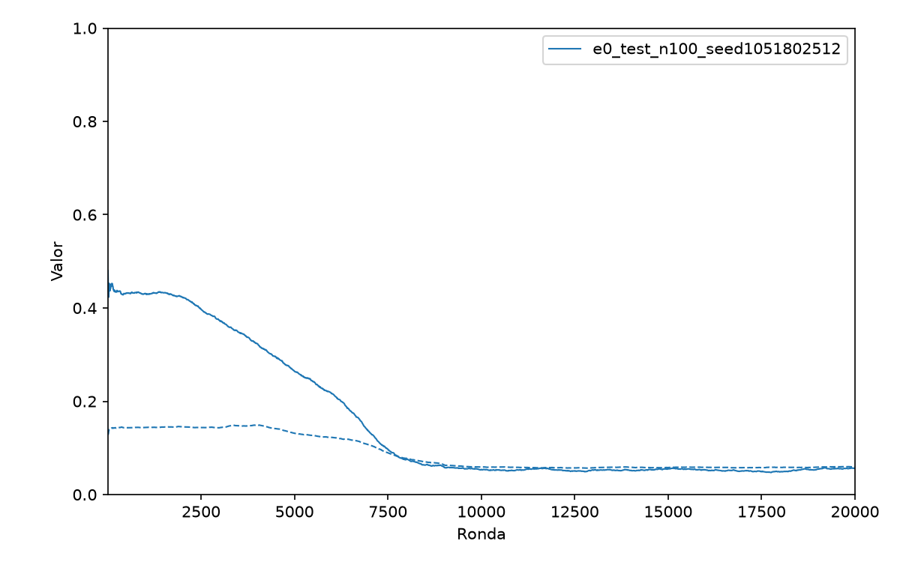
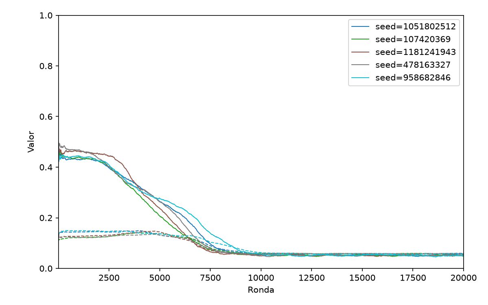
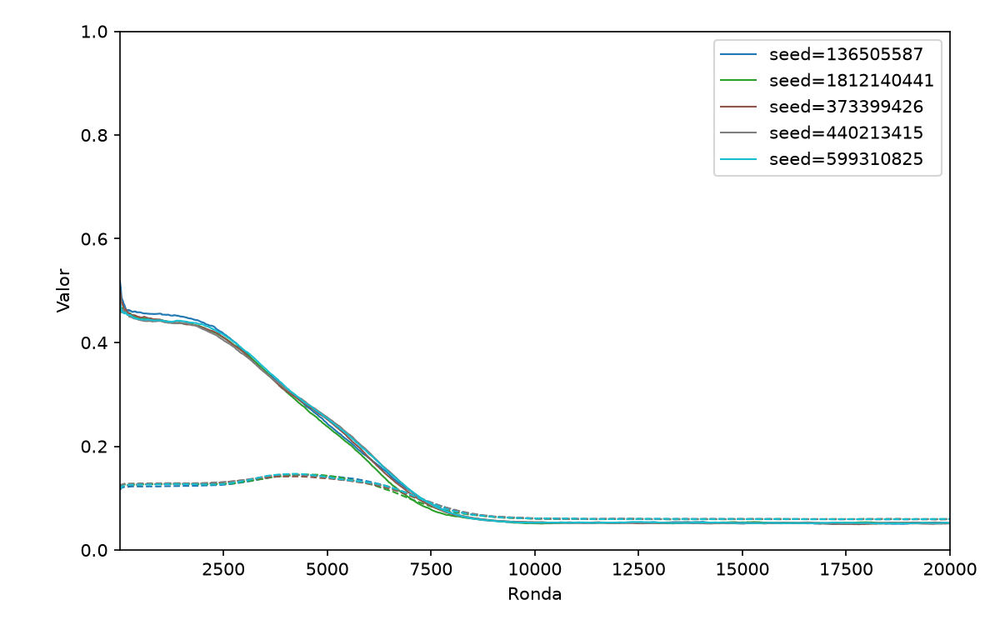
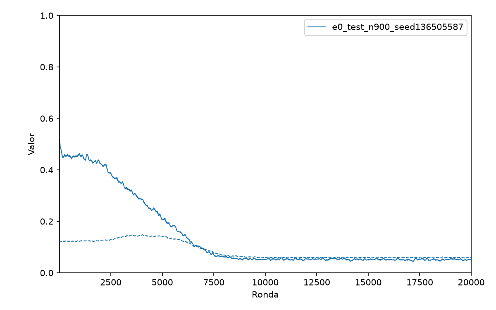
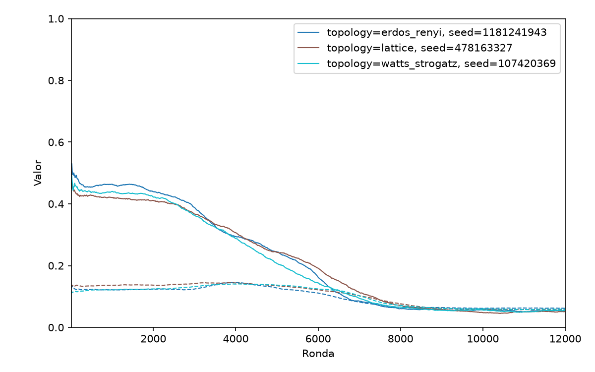
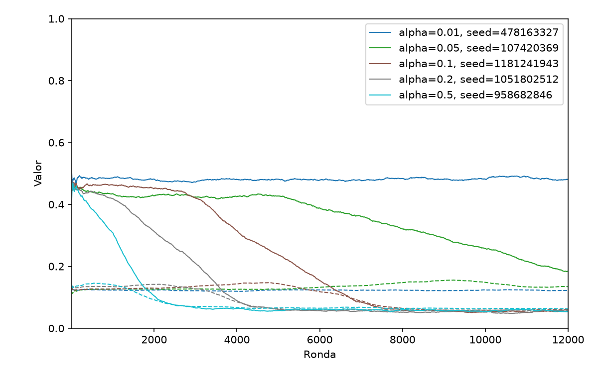
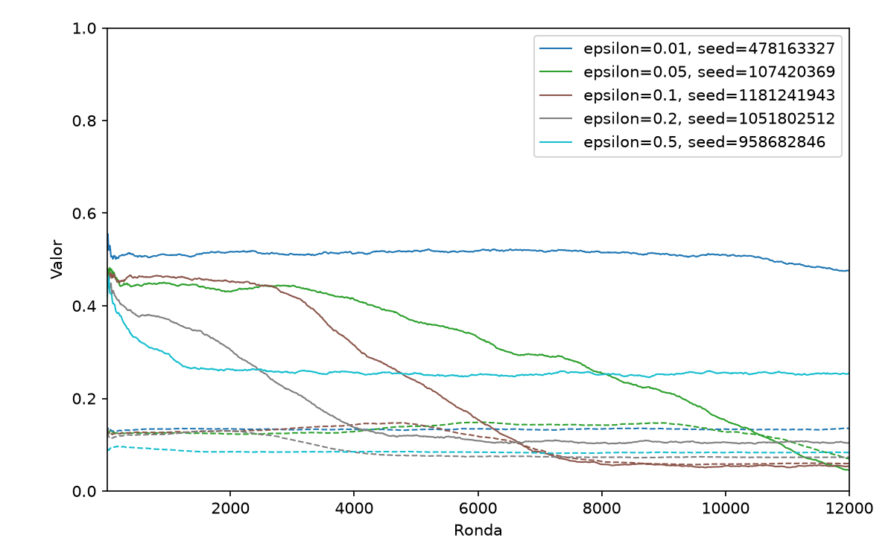
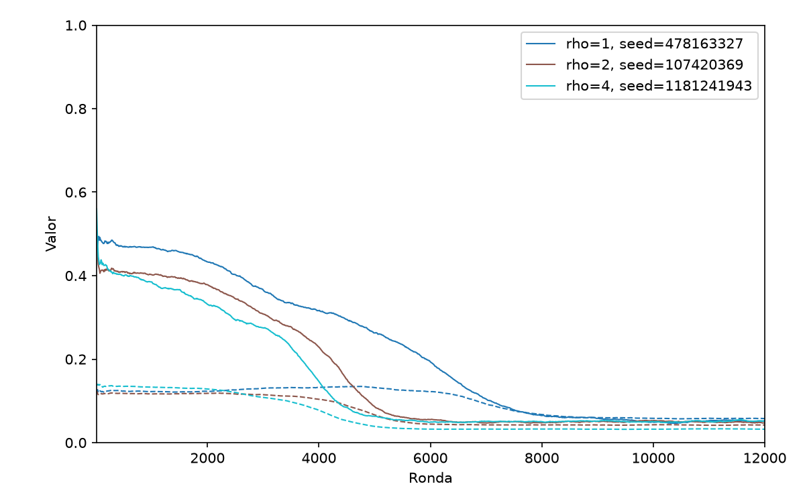

# QOOPERATE — Experimentos y conclusiones V1

Este documento resume la primera tanda de experimentos realizados sobre el framework QOOPERATE descrito en `README.md` y
los resultados y conclusiones obtenidas a partir de ellos.

**Recordatorio**: La representación gráfica de las dos métricas analizadas en los experimentos, Cooperación $C_t$ y el
Índice de Gini $G$, se muestran en los gráficos como línea continua y de trazos, respectivamente.

## E0 — Calibración de parámetros

Los experimentos en E0 tuvieron como objetivo encontrar una configuración de referencia para los experimentos
posteriores. Se buscó determinar la cantidad de semillas, agentes, rondas y smoothing que permitieran obtener resultados
consistentes.

### Parámetros comunes a E0

Para el experimento E0, todas las corridas compartieron los siguientes parámetros:

| Parámetro            | Valor          |
|----------------------|----------------|
| topology             | watts_strogatz |
| k                    | 8              |
| alpha                | 0.1            |
| epsilon              | 0.1            |
| gamma                | 0.9            |
| rho                  | 1              |
| n_rounds             | 20000          |
| reward_window        | 10             |
| sample_every         | 10             |
| coop_n_divisions     | 2              |
| reward_n_divisions   | 2              |
| ws_beta              | 0.1            |
| state_representation | 1234           |

### Determinación de cantidad de semillas y rondas

Se realizaron corridas con `n_agents ∈ {100, 900}` y `n_seeds=5`.

Con `n_agents=100` y `n_seeds=5`, el gráfico resultante fue el siguiente:

Con `n_agents=900` y `n_seeds=5`, el gráfico resultante fue el siguiente:

**Resultados**:

- Se adopta `n_seeds=1` para los experimentos posteriores, ya que los comportamientos de las curvas de $C_t$ y $G$
  fueron prácticamente indistinguibles entre semillas.
- Se adopta `n_rounds=12000` para los experimentos posteriores, ya que $C_t$ y $G$ alcanzan un régimen estable hacia la
  ronda 10000.

### Determinación de cantidad de agentes y smoothing

Se realizaron corridas con `n_agents = 900` y `plot_smoothing ∈ {10, 100}`.

Con `plot_smoothing=10`, el gráfico resultante fue el siguiente:

Con `plot_smoothing=100`, el gráfico resultante fue el siguiente:

**Resultados**:

- Se adopta `n_agents=100` para los experimentos posteriores, ya que aumentar la población no aportó información
  adicional apreciable.
- Se adopta `plot_smoothing=100` para los experimentos posteriores, ya que es un valor que permite suavizar la curva de
  forma acorde con la cantidad de rondas.

### Conclusiones de E0

Además de los parámetros comunes ya mencionados, se toma como referencia para los experimentos posteriores a los
siguientes parámetros:

| Parámetro      | Valor |
|----------------|-------|
| n_agents       | 100   |
| n_seeds        | 1     |
| n_rounds       | 12000 |
| plot_smoothing | 100   |

Por lo tanto, la tabla final de parámetros de comunes para los experimentos posteriores es la siguiente:

| Parámetro          | Valor                                     |
|--------------------|-------------------------------------------|
| ~~topology~~       | _varía en E1, fija en WS para los demás_  |
| ~~alpha~~          | _varía en E2, fija en 0.1 para los demás_ |
| ~~epsilon~~        | _varía en E3, fija en 0.1 para los demás_ |
| ~~rho~~            | _varía en E4, fija en 1 para los demás_   |
| n_agents           | 100                                       |
| k                  | 8                                         |
| gamma              | 0.9                                       |
| n_seeds            | 1                                         |
| n_rounds           | 12000                                     |
| reward_window      | 10                                        |
| sample_every       | 10                                        |
| coop_n_divisions   | 2                                         |
| reward_n_divisions | 2                                         |
| ws_beta            | 0.1                                       |
| plot_smoothing     | 100                                       |

**Nota**: los parámetros ~~tachados~~ son los que se específicamente se estudian en los experimentos posteriores.

## E1 — Topología

Se realizaron corridas para `topology ∈ {lattice, watts_strogatz, erdos_renyi}`, el gráfico resultante fue el siguiente:

**Observaciones**:

- Las 3 topologías alcanzaron niveles finales de $C_t$ y $G$ prácticamente iguales. Aunque las curvas presentaron
  pequeñas diferencias transitorias, ninguna estructura produjo un régimen estacionario distinto.

## E2 — Tasa de aprendizaje α

Se realizaron corridas para `α ∈ {0.01, 0.05, 0.1, 0.2, 0.5}`, el gráfico resultante fue el siguiente:

**Observaciones**:

- Los valores de `α` modificaron principalmente la velocidad hacia el equilibrio. Las tasas mayores llevaron más
  rápidamente al régimen estacionario. Sin embargo, ninguna configuración produjo un nivel final de cooperación
  sustancialmente diferente.

## E3 — Exploración ε

Se realizaron corridas para `ε ∈ {0.01, 0.05, 0.1, 0.2, 0.5}`, el gráfico resultante fue el siguiente:

**Observaciones**:

- `ε` afectó de forma inversa a cómo lo hizo la tasa de aprendizaje. Nuevamente, el nivel final de cooperación fue
  prácticamente independiente de
  `ε`. Esto puede describirse debido a las posibilidades sin éxito, pero exploradas al fin, de encontrar estrategias
  cooperativas en un entorno que tiende a la deserción.

## E4 — Profundidad de información del vecindario ρ

Se realizaron corridas para `ρ ∈ {1, 2, 4}`, el gráfico resultante fue el siguiente:

**Observaciones**:

- El aumento de `ρ` produjo mayor velocidad hacia la convergencia, pero nuevamente no modificó sustancialmente el nivel
  final de cooperación. La información adicional permitió al agente reaccionar a un entorno más amplio, pero no generó
  cooperación sostenida, sino que al contrario, el efecto de la no-cooperación se propagó más rápidamente.

## Conclusiones

Los resultados muestran que $C_t$ colapsa a niveles bajos en todas las configuraciones. Los parámetros estudiados
afectan principalmente la velocidad de convergencia y la variabilidad transitoria, pero no el régimen estacionario. En
general, una mayor proporción de explotación, conectividad, profundidad del vecindario o tasa de aprendizaje tienden a
acelerar la convergencia.

$G$ presenta una relación vaga, pero directa al fin, con la $C_t$: mayores niveles de cooperación se asocian con una
mayor desigualdad en las recompensas.

La ausencia de cooperación sostenida es consistente con una limitación del modelo: el estado agrega la información del
vecindario, pero no conserva la identidad ni el historial de cada vecino. Por ello, los agentes no pueden implementar
mecanismos de reciprocidad directa como la estrategia Tit-for-Tat. Incorporar memoria individual o la identidad de los
vecinos permitiría estudiar mecanismos de cooperación más cercanos a los de la literatura clásica sobre el dilema del
prisionero, aunque esto implicaría un espacio de estados considerablemente mayor.
