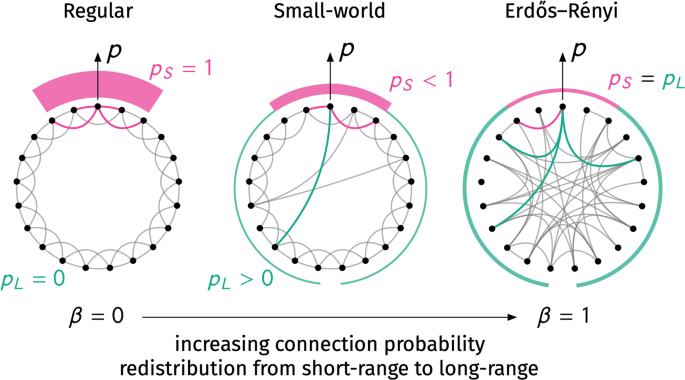

# QOOPERATE

**Multi-Agent / Public Goods Prisoner's Dilemma** — estudio del surgimiento o colapso de la cooperación en redes de
agentes Q-Learning que juegan un Dilema del Prisionero Iterado con sus vecinos.

**Código:** `QOOPERATE`

**Alumno:** Adriano Fabris

---

## Instalación

Colocarse en la carpeta `/code` del proyecto y ejecutar:

```bash
pip install -e .
```

Instala `qooperate` (en `src/qooperate/`) en modo editable, de modo que cualquier cambio en el código fuente se refleje
inmediatamente sin necesidad de reinstalar.

---

## Objetivo

El proyecto busca explorar el surgimiento o colapso de la cooperación en sociedades artificiales dinámicas compuestas
por agentes racionales que aprenden mediante refuerzo, evaluando cómo la estructura social (topología de red) y el
alcance de la información local influyen en el comportamiento colectivo.

La meta principal es observar bajo qué condiciones emergen patrones estables de cooperación o, si no es posible, por
qué.

---

## Teoría Involucrada

El trabajo se apoya en dos ejes conceptuales: el Reinforcement Learning (RL) y la Game Theory.

### Reinforcement Learning

En el primero, cada agente aplica el algoritmo **Q-Learning**, cuya regla de actualización se expresa como:

$$Q(s,a) \leftarrow Q(s,a) + \alpha \big(r + \gamma \max_{a'} Q(s',a') - Q(s,a)\big)$$

donde $\alpha$ es la tasa de aprendizaje, $\gamma$ el factor de descuento, $r$ la recompensa inmediata y $(s, a)$ el par
estado-acción.

En un entorno multiagente, cada individuo percibe un _entorno no estacionario_, ya que los demás también aprenden y
adaptan su política, generando una dinámica colectiva cambiante. Por tanto, el objetivo no es la convergencia del
aprendizaje, que bajo esta premisa deja de estar garantizada, sino la observación y el análisis del comportamiento
adaptativo del sistema.

### Game Theory

Cada interacción entre agentes se modela como un **Dilema del Prisionero iterado (IPD)**,
donde ambos
agentes eligen una acción entre 2 posibles: cooperar (C) o desertar (D).

El Dilema del Prisionero es un juego de suma no nula, donde la cooperación mutua genera un beneficio conjunto mayor que
la deserción
mutua, si bien la acción de desertar frente a un cooperador resulta ser la mejor opción desde el punto de vista
individual.
La iteración surge de la repetición de este juego entre distintos pares de agentes situados en un grafo, permitiendo que
se desarrollen estrategias basadas en la historia de interacciones previas.

La matriz de recompensas utilizada es la canónica de la literatura, y por lo tanto cumple $T > R > P > S$
y $2R > T + S$, correspondientes a la definición del Dilema del Prisionero donde:

| Parámetro                                | Símbolo | Valor |
|------------------------------------------|---------|-------|
| Tentación (desertor frente a cooperador) | T       | 5     |
| Recompensa (cooperación mutua)           | R       | 3     |
| Castigo (deserción mutua)                | P       | 1     |
| Sucker (cooperador frente a desertor)    | S       | 0     |

### Topologías de Interacción

Las simulaciones se realizan sobre tres tipos de redes.

1. Regular o Lattice (LA): cada nodo tiene el mismo número $k$ de vecinos conectados localmente.
2. Small-World o Watts–Strogatz (WS): comienza como una red regular; luego algunas aristas se reconfiguran con
   probabilidad $\beta$.
3. Erdős–Rényi (ER): las aristas se colocan entre dos nodos cualesquiera con una probabilidad fija $p$.


---

## Descripción del Framework

El entorno modela una población de $N$ agentes, cada uno de los cuales interactúa con sus vecinos definidos por la red.
En cada ronda, cada agente juega un Dilema del Prisionero con sus contactos, elige su acción $a_t \in \{C, D\}$
siguiendo una política $\varepsilon$-greedy y actualiza su tabla $Q$ con base en la recompensa media obtenida.

Es importante destacar que no existe una fase de entrenamiento separada; los agentes aprenden y adaptan su
comportamiento durante toda la simulación. El _aprendizaje y la interacción ocurren simultáneamente_, es por ello que la
convergencia no está garantizada.

El **estado local** $s$ está definido por un conjunto reducido de variables:

- Acción mayoritaria observada en el vecindario en la ronda anterior
- Última acción propia
- Tasa de cooperación del vecindario en la ronda anterior
- Recompensa media propia reciente

Estas variables se discretizan para mantener un espacio de estados manejable.

El vecindario de juego (con quién interactúa y cobra recompensa cada agente, y sobre quién se calculan las dos variables
de estado anteriores) puede extenderse más allá de los vecinos directos mediante el parámetro `ρ`: `ρ=1` es el
vecindario directo de la red; `ρ>1` incluye también vecinos a distancia 2, 3, ... (vía BFS sobre el grafo).

---

## Diseño

Cada archivo YAML en `config/` describe una única corrida.

### Parámetros configurables

| Parámetro            | Descripción                                                                                                           | Valor por defecto | Restricciones                                         |
|----------------------|-----------------------------------------------------------------------------------------------------------------------|-------------------|-------------------------------------------------------|
| `topology`           | Tipo de red: `lattice`, `watts_strogatz` o `erdos_renyi`                                                              | `lattice`         | —                                                     |
| `n_agents`           | Cantidad de agentes ($N$)                                                                                             | `100`             | debe ser cuadrado perfecto (`100`, `400`, `900`, ...) |
| `k`                  | Grado de conectividad                                                                                                 | `8`               | debe ser `4`, `8` o `12`                              |
| `alpha`              | Tasa de aprendizaje en Q-Learning                                                                                     | `0.1`             | > 0                                                   |
| `epsilon`            | Parámetro de exploración ε-greedy                                                                                     | `0.1`             | > 0                                                   |
| `gamma`              | Factor de descuento en Q-Learning                                                                                     | `0.9`             | > 0                                                   |
| `rho`                | Profundidad del vecindario de juego (ver Framework)                                                                   | `1`               | ≥ 1                                                   |
| `seed`               | Semilla para reproducibilidad                                                                                         | `0`               | ≥ 0                                                   |
| `n_rounds`           | Cantidad de rondas de la simulación                                                                                   | `2000`            | > 0                                                   |
| `reward_window`      | Ventana de recompensa reciente usada en el estado                                                                     | `10`              | ≥ 1                                                   |
| `sample_every`       | Cada cuántas rondas se guarda un punto en el resultado (granularidad del muestreo; no afecta el aprendizaje)          | `10`              | ≥ 1                                                   |
| `coop_n_divisions`   | Cantidad de divisiones para discretizar la tasa de cooperación del vecindario (equiespaciadas en [0,1])               | `2`               | ≥ 0                                                   |
| `reward_n_divisions` | Cantidad de divisiones para discretizar la recompensa reciente (equiespaciadas en [0,5], rango de la matriz de pagos) | `2`               | ≥ 0                                                   |
| `ws_beta`            | Probabilidad de reconexión en Watts-Strogatz                                                                          | `0.1`             | en [0, 1]                                             |

---

## Uso

### 1. Generar YAMLs interactivamente

```bash
python experiments/generate_yamls.py
```

Pide un nombre de experimento y luego cada parámetro de la tabla anterior, uno por uno, con su valor por defecto entre
paréntesis (cuando se presiona _enter_ se acepta el valor por defecto). Se puede pasar más de un valor por parámetro,
separados por espacio (ej.
`alpha (debe ser > 0) (default: 0.1): 0.05 0.1 0.2`) — el script arma el **producto cartesiano** de todas las
combinaciones y escribe un YAML por combinación en `config/<experimento>/`, nombrando cada archivo solo con los
parámetros que realmente varían (los que quedaron fijos no aparecen en el nombre). Antes de escribir nada muestra un
resumen de los YAMLs a generar y pide confirmación. Escribir `Q` en cualquier prompt cancela la sesión sin generar nada.
Cada parámetro se valida al ingresarlo (ej. `k` debe ser 4/8/12, `n_agents` debe ser cuadrado perfecto) y, si un valor
no es válido, se vuelve a pedir solo ese parámetro.

### 2. Correr las corridas

```bash
python experiments/run.py <config_yaml> [<config_yaml2> ...]
```

Ejemplo:

```bash
python experiments/run.py config/e0/e0_s0.yaml config/e0/e0_s1.yaml
```

Cada YAML se corre de forma independiente; guarda su Parquet en `results/<prefijo>/<nombre_yaml>.parquet`, con la
evolución temporal completa (muestreada según `sample_every`) de tasa de cooperación, recompensa media y Gini de
ventana.

### 3. Generar figuras

```bash
python experiments/figures.py <plot_smoothing> results/e0/e0_*.parquet
```

Por cada Parquet genera **un** PNG con fondo transparente, mostrando ambas métricas superpuestas en el mismo gráfico y
con el mismo color aleatorio por corrida:

- **Línea continua** — tasa global de cooperación ($C_t$)
- **Línea punteada** — índice de Gini de ventana (desigualdad reciente de recompensas)

Incluye leyenda para distinguir ambas curvas. `plot_smoothing` (primer argumento, no vive en el YAML) es el tamaño de la
media móvil aplicada solo al graficar, sin afectar los datos guardados.

---

## Métricas de Evaluación

El análisis se basa en dos series temporales, registradas ronda a ronda sin suavizar (el suavizado solo se aplica al
graficar, ver `plot_smoothing` arriba):

- **Tasa global de cooperación $C_t$**: proporción de agentes cooperadores en cada ronda.
- **Índice de Gini de ventana $G$**: desigualdad en la distribución de la recompensa acumulada dentro de la ventana
  reciente de `sample_every` rondas (no es un Gini histórico acumulado desde el inicio de la simulación, sino uno que
  se reinicia en cada punto de muestreo — mide desigualdad reciente/local).

---

## Hipótesis

### Hipótesis Fundamentales

**H1. Efecto de la estructura:** la topología de la red afecta significativamente el nivel final de cooperación. ¿La
forma en que los agentes están conectados influye en su capacidad para cooperar?

**H2. Efecto del aprendizaje:** una tasa de aprendizaje moderada ($0.05 < \alpha < 0.3$) permite mayor estabilidad que
valores extremos. ¿La convergencia hacia el equilibrio puede verse favorecida por la tasa de aprendizaje?

**H3. Exploración controlada:** valores intermedios de $\varepsilon$ (entre 0.05 y 0.2) favorecen el equilibrio entre
exploración y cooperación sostenida. ¿Cómo impacta el tiempo destinado a explorar en la cooperación a largo plazo?

### Hipótesis Alternativas

**HA1.** La desigualdad en la distribución de recompensas depende de la topología de la red y del grado medio de
conectividad.

**HA2.** La inclusión de información de vecinos de mayor orden ($\rho > 1$) puede fortalecer la cooperación.


---

## Notas

> En versiones previas de este documento aparecían formulaciones distintas para HA1/HA3 (agentes aleatorios que
> previenen el colapso de cooperación; Gini vs. grado de conectividad como hipótesis separada).
> Las hipótesis alternativas se han unificado y simplificado para reflejar mejor la intención original del proyecto, que
> es explorar la interacción entre agentes Q-Learning.

> Se agrega a la bibliografía el libro de Brunton & Kutz (2019) como referencia para la parte de RL (capítulo 11:
> Reinforcement Learning).

---

## Referencias

**Libros**

- Russell, S. & Norvig, P. (2021). *Artificial Intelligence: A Modern Approach* (4ª ed.).
- Axelrod, R. (1984). *The Evolution of Cooperation*.
- Brunton, S. & Kutz, J. (2019). *Data-Driven Science and Engineering: Machine Learning, Dynamical Systems, and
  Control*.

**Papers**

- Shoham, Y. et al. (2007). *If multi-agent learning is the answer, what is the question?*.

**Videos**

- Veritasium (2022). *This game theory problem will change the way you see the
  world*. [YouTube](https://www.youtube.com/watch?v=mScpHTIi-kM)

- Veritasium (2023). *Something Strange Happens When You Trace How Connected We
  Are*. [YouTube](https://www.youtube.com/watch?v=CYlon2tvywA&t=500s)

**Recursos en el repositorio**

- `/archive/anteproyecto.md` — definición inicial del proyecto, hipótesis y plan de trabajo

---

```