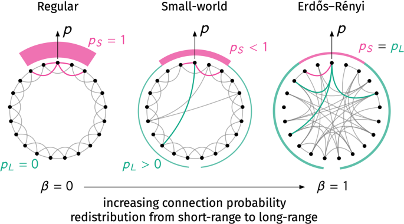

# QOOPERATE

Estudio del surgimiento o colapso de la cooperación en redes de agentes Q-Learning que juegan un Dilema del Prisionero
Iterado con sus vecinos.

**Código:** `QOOPERATE`

**Alumno:** Adriano Fabris

---

## Objetivo

El proyecto busca explorar el surgimiento o colapso de la cooperación en sociedades artificiales dinámicas compuestas
por agentes racionales que aprenden mediante refuerzo, evaluando cómo la estructura social (topología de red) y la
utilización de la información local influyen en el comportamiento colectivo.

---

## Teoría Involucrada

El trabajo se apoya en dos ejes conceptuales: el Reinforcement Learning (RL) y la Game Theory.

### Reinforcement Learning

Los agenten aplican el algoritmo de **Q-Learning**, cuya regla de actualización se expresa como:

$$Q (s,a) \leftarrow Q (s,a) + \alpha \big (r + \gamma \max_{a'} Q (s',a') - Q (s,a)\big)$$

donde $\alpha$ es la tasa de aprendizaje, $\gamma$ el factor de descuento, $r$ la recompensa inmediata y $(s, a)$ el par
estado-acción.

En un entorno multiagente como el del este proyecto, cada individuo percibe un _entorno no estacionario_, ya que los
demás también aprenden y adaptan su política. Por tanto, el objetivo no es la convergencia del aprendizaje, que bajo
esta premisa deja de estar garantizada, sino la observación y el análisis del comportamiento adaptativo del sistema.

### Game Theory

Cada interacción entre agentes se modela como un **Dilema del Prisionero iterado (IPD)**, donde ambos agentes eligen una
acción entre 2 posibles: cooperar (C) o desertar (D).

El Dilema del Prisionero es un juego de suma no nula donde la cooperación mutua genera un beneficio conjunto mayor que
la deserción mutua aún cuando la acción de desertar frente a un cooperador resulta ser la mejor opción desde el punto de
vista individual y cortoplacista. La iteración surge de la repetición de este juego entre distintos pares de agentes
situados en un grafo.

La matriz de recompensas utilizada es la canónica de la literatura, y por lo tanto cumple $T > R > P > S$
y $2R > T + S$, correspondientes a la definición del Dilema del Prisionero.

| Parámetro                                | Símbolo | Valor |
|------------------------------------------|---------|-------|
| Tentación (desertor frente a cooperador) | T       | 5     |
| Recompensa (cooperación mutua)           | R       | 3     |
| Castigo (deserción mutua)                | P       | 1     |
| Sucker (cooperador frente a desertor)    | S       | 0     |

### Topologías de Interacción

Las simulaciones se realizan sobre tres tipos de redes.

1. Regular o Lattice (LA): cada nodo tiene el mismo número $k$ de vecinos conectados localmente.
2. Small-World o Watts–Strogatz (WS): comienza como una red regular; luego algunas aristas se reconfiguran con
   probabilidad $\beta$.
3. Erdős–Rényi (ER): las aristas se colocan entre dos nodos cualesquiera con una probabilidad fija $p$.


---

## Descripción del Framework

El entorno modela una población de $N$ agentes, cada uno de los cuales interactúa con sus vecinos definidos por el
grafo. En cada ronda, cada agente juega un Dilema del Prisionero con sus vecinos, elige su acción $a_t \in \{C, D\}$
siguiendo una política $\varepsilon$-greedy.

Es importante destacar que no existe una fase de entrenamiento separada; los agentes aprenden y aplican la política
aprendida simultáneamente durante toda la simulación.

El estado $s$ de cada agente está definido por el conjunto de variables:

- s1: Acción mayoritaria observada en el vecindario en la ronda anterior
- s2: Última acción propia
- s3: Tasa de cooperación del vecindario en la ronda anterior
- s4: Recompensa media propia reciente (reciente = promedio de recompensas obtenidas en las últimas `reward_window`
  rondas)

Estas variables se discretizan para mantener un espacio de estados manejable.

El vecindario de juego (con quién interactúa y cobra recompensa cada agente, y sobre quién se calculan las dos variables
de estado anteriores) puede extenderse más allá de los vecinos inmediatos mediante el parámetro `ρ`: `ρ=1` es el
vecindario directo del agente; `ρ=2` incluye también vecinos a distancia 2 y así sucesivamente (vía BFS sobre el grafo).

---

## Diseño

Cada archivo YAML en `config/` describe una única corrida y, por lo tanto, una única combinación de valores de
parámetros.

### Parámetros configurables

| Parámetro              | Descripción                                                                                                           | Restricciones                                         |
|------------------------|-----------------------------------------------------------------------------------------------------------------------|-------------------------------------------------------|
| `n_rounds`             | Cantidad de rondas de la simulación                                                                                   | > 0                                                   |
| `n_agents`             | Cantidad de agentes $N$                                                                                               | debe ser cuadrado perfecto (`100`, `400`, `900`, ...) |
| `topology`             | Tipo de red: `lattice`, `watts_strogatz` o `erdos_renyi`                                                              | —                                                     |
| `state_representation` | Representación del estado: `S1`, `S12`, `S123` o `S1234`                                                              | —                                                     |
| `k`                    | Grado (medio para WS y ER) de conectividad de la red                                                                  | debe ser `4`, `8` o `12`                              |
| `alpha`                | Tasa de aprendizaje en Q-Learning                                                                                     | > 0                                                   |
| `epsilon`              | Parámetro de exploración ε-greedy                                                                                     | > 0                                                   |
| `rho`                  | Profundidad del vecindario                                                                                            | ≥ 1                                                   |
| `gamma`                | Factor de descuento en Q-Learning                                                                                     | > 0                                                   |
| `reward_window`        | Ventana de recompensa reciente usada en el estado                                                                     | ≥ 1                                                   |
| `sample_every`         | Cada cuántas rondas se guarda un punto en el resultado (granularidad del muestreo; no afecta el aprendizaje)          | ≥ 1                                                   |
| `coop_n_divisions`     | Cantidad de divisiones para discretizar la tasa de cooperación del vecindario (equiespaciadas en [0,1])               | ≥ 0                                                   |
| `reward_n_divisions`   | Cantidad de divisiones para discretizar la recompensa reciente (equiespaciadas en [0,5], rango de la matriz de pagos) | ≥ 0                                                   |
| `ws_beta`              | Probabilidad de reconexión en Watts-Strogatz                                                                          | en [0, 1]                                             |
| `n_seeds`              | Cantidad de semillas para la corrida                                                                                  | ≥ 0                                                   |

---

## Estructura del Repositorio

```text
code/
├── src/qooperate/         
│   ├── agent.py            # Agente Q-learning
│   ├── network.py          # Topologías
│   ├── simulation.py       # Loop de aprendizaje
│   ├── payoff.py           # Matriz del IPD
│   ├── utils.py            
│   └── metrics.py          
│
├── experiments/            
│   ├── generate_yamls.py   # Genera la configuración de los experimentos mediante archivos .yaml  
│   ├── run.py              # Ejecuta los experimentos y guarda datos y artefactos
│   ├── figures.py          # Genera figuras comparativas a partir de los .parquets
│   └── viewer.py           # Replay interactivo de una corrida
│
├── config/<exp>/           # Configuración .yaml de cada experimento
│
├── results/
│   ├── data/               # Datos .parquet y artefactos .npz de las corridas
│   └── figures/            # Figuras
│    
└── pyproject.toml          # Dependencias
```

## Instalación

Desde `code/`:

```bash
python3 -m venv .venv
source .venv/bin/activate
pip install --upgrade pip
pip install -e .
```

## Flujo normal

### 1) Generar YAMLs

```bash
python experiments/generate_yamls.py
```

El script pide un nombre de experimento y luego los parámetros uno por uno. Si se ingresan varios valores, genera el
producto cartesiano y escribe un YAML por combinación en `config/<experimento>/`.

### 2) Ejecutar una corrida

```bash
python experiments/run.py <config_yaml> [<config_yaml2> ...]
```

`run.py` guarda en `results/data/<prefijo>/`:

- `<stem>.parquet` con las métricas muestreadas;
- `learning_<stem>.npz` con `delta_q` y visitas de estados;
- `replay_<stem>.npz` con acciones, recompensas e historiales por ronda.

### 3) Generar figuras

```bash
python experiments/figures.py <plot_smoothing> <data_parquet1> [<data_parquet2> ...]
```

`figures.py` compara uno o más parquets y escribe un PNG en `results/figures/<prefijo>/`, usando el prefijo común del
stem.

### 4) Abrir replay manualmente

```bash
python experiments/viewer.py <data_parquet1> [<data_parquet2> ...]
```

El replay consume el parquet y sus `learning_*.npz` / `replay_*.npz` asociados. No vuelve a correr la simulación.

---

## Referencias

**Libros**

- Axelrod, R. (1984). *The Evolution of Cooperation*.
- Brunton, S. & Kutz, J. (2019). *Data-Driven Science and Engineering: Machine Learning, Dynamical Systems, and
  Control*.

**Videos**

- Veritasium (2022). *This game theory problem will change the way you see the
  world*. [YouTube](https://www.youtube.com/watch?v=mScpHTIi-kM)

- Veritasium (2023). *Something Strange Happens When You Trace How Connected We
  Are*. [YouTube](https://www.youtube.com/watch?v=CYlon2tvywA&t=500s)

**Recursos en el repositorio**

- `/archive/anteproyecto.md` — definición inicial del proyecto.

---