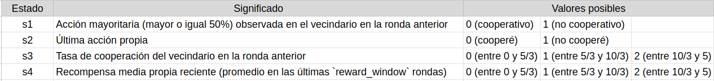
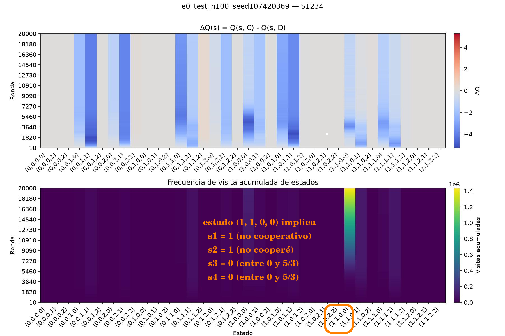
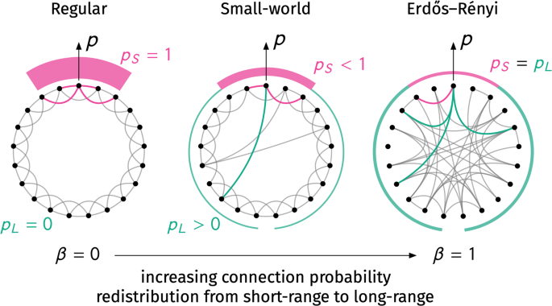

# QOOPERATE — Estudio del aprendizaje de cooperación en el Dilema del Prisionero multiagente

**Alumno:** Adriano Fabris — **Código:** QOOPERATE

---

## 1. Introducción

El problema de la cooperación entre individuos que persiguen su propio interés, sin que exista una autoridad central
que los obligue a coordinarse, es uno de los problemas clásicos de la teoría de juegos. El Dilema del Prisionero
Iterado (IPD) es el modelo formal más usado para estudiarlo: dos jugadores eligen repetidamente entre cooperar (`C`)
o desertar (`D`), y la estructura de pagos hace que desertar sea la mejor respuesta a corto plazo aunque la
cooperación mutua produzca, en conjunto, un resultado mejor. Robert Axelrod estudió este problema mediante torneos
computacionales de estrategias y mostró que la reciprocidad —responder a lo que hizo el oponente— puede sostener la
cooperación cuando el juego se repite lo suficiente.

Este proyecto traslada ese problema a una población de agentes conectados por una red, que juegan el IPD con sus
vecinos y aprenden su comportamiento mediante Q-Learning en lugar de seguir una estrategia fija. A
diferencia de los torneos de Axelrod, aquí nadie programa una estrategia: el agente construye, ronda a ronda, una
tabla de valores $Q (s,a)$ a partir de lo que efectivamente le pasó, donde $s$ resume información de su vecindario.

La primera etapa del proyecto tuvo como objetivo encontrar *condiciones bajo las cuales emergiera
cooperación*. Todos los experimentos de esa etapa dieron el mismo resultado cualitativo: la población converge hacia
la deserción. Esto motivó una segunda etapa: en lugar de buscar tales condiciones nos preguntamos *cómo aprende el
agente lo que termina haciendo*, usando la diferencia
$\Delta Q (s) = Q (s,C) - Q (s,D)$ y la frecuencia de visita $F (s)$ de cada estado a lo largo del entrenamiento.

El resto del informe se organiza así: la Sección 2 repasa el marco teórico necesario, con énfasis en la comparación
entre
la información que disponible de una estrategia del torneo original y la que usa nuestro agente. La Sección 3 describe
el sistema, las métricas y el
diseño de los cinco experimentos (E1–E5). La Sección 4 analiza los resultados, priorizando la evolución temporal del
aprendizaje —qué estados importan en cada etapa, cuándo se separa $\Delta Q$ de $F$, qué es esperable y qué no— sobre
los valores finales. La Sección 5 cierra con las conclusiones y las limitaciones del diseño experimental.

---

## 2. Marco teórico

### 2.1. Dilema del Prisionero y su versión iterada

En el Dilema del Prisionero de una jugada, cada jugador elige `C` o `D` y los pagos cumplen

$$
T > R > P > S, \qquad 2R > T+S,
$$

con la matriz canónica usada en el proyecto: $T=5$ (tentación), $R=3$ (recompensa mutua), $P=1$ (castigo mutuo),
$S=0$ (pago del cooperador explotado). Desertar domina individualmente a cooperar sea cual sea la acción del otro
jugador, pero la deserción mutua $P$ es peor para ambos que la cooperación mutua $R$. Cuando el juego se repite (como en
el caso de un IPD), la acción de hoy puede condicionar la respuesta del otro mañana, y ahí aparece el espacio para la
reciprocidad.

Axelrod organizó torneos computacionales de estrategias para el IPD y encontró que la estrategia TIT FOR TAT —cooperar
en la
primera ronda y después repetir la última acción del oponente— ganó ambas rondas del torneo pese a competir contra
reglas mucho más sofisticadas. El resultado no se debe a que TIT FOR TAT "gane" cada partida individual (de hecho
nunca obtiene más puntos que su oponente en una partida dada), sino a que es *nice* (nunca deserta primero),
*provocable* (responde a una deserción) y *forgiving* (no queda anclada en un castigo indefinido).

### 2.2. Condiciones de estabilidad: ¿qué hace falta para que la cooperación se sostenga?

Dos resultados de Axelrod son especialmente relevantes para este proyecto.

Para entender las Proposiciones 5 y 6 es necesario introducir dos conceptos, el de una población ALL D, y el de
invasión:

- ALL D: dícese de una población en la que todos sus individuos desertan. Esta población tiene un beneficio típico $P$.

- Invasión: una población (invasora) puede *invadir* a una población (invadida) si la pobación invasora obtiene
  beneficio mayor que el típico de la población invadida.

**Proposición 5 (ALL D no es invadible por una población compuesta por un sólo individuo).** Ningún individuo aislado
puede invadir a ALL D, ya que cooperar en ese entorno da $S$, desertar da $P$, y $P>S$.

**Proposición 6 (ALL D es invadible por una población discriminante).** Lo que sí puede invadir ALL D es un grupo de
agentes que usan una
estrategia *maximally discriminating*: coopera con su propio tipo y dejan de cooperar con quien no tiene una actitud
recíproca. Para esto la estrategia necesita distinguir *con quién* está jugando y *qué hizo antes*.

En resumen, para que tenga lugar una invasión de una población cooperativa sobre otra, esta primera debe poder
*discriminar* con quién está interactuando y cuál fue el historial de la interacción, esto con el fin de poder aplicar
reciprocidad con los propios, y no con los ajenos. Tales condiciones, como veremos durante el desarrollo de los
experimentos y resultados de la primera etapa de este trabajo, no fueron satisfechas.

### 2.3. Q-Learning

El agente actualiza su tabla $Q (s, a)$ con la regla

$$
Q (s,a) \leftarrow Q (s,a) + \alpha\big[r + \gamma\max_{a'}Q (s',a') - Q (s,a)\big],
$$

donde $\alpha$ es la tasa de aprendizaje, $\gamma$ el factor de descuento, $r$ la recompensa inmediata y $(s, a)$ el par
estado-acción.

El agente selecciona acciones con una política $\epsilon$-greedy: explora con probabilidad $\epsilon$, y en caso
contrario
elige $\arg\max_a Q (s,a)$. La medida $\Delta Q (s) = Q (s,C)-Q (s,D)$ resume qué acción prefiere el agente
en cada estado: negativa favorece `D`, positiva favorece `C`.

### 2.4. Aprendizaje multiagente no estacionario

Cuando todos los agentes aprenden a la vez, cada uno modifica el entorno de los demás: la política de un vecino en la
ronda $t$ no es la misma que en $t+1000$. Esto rompe los supuestos habituales de convergencia de Q-Learning para un
único agente en un entorno fijo. Por eso el proyecto no busca una política óptima sino encontrar los patrones para la
emergencia de ciertos comportamientos.

### 2.5. Estados, ¿fue suficiente la información del agente para lograr esa reciprocidad?

El estado $s$ de cada agente se arma con los siguientes cuatro subestados:

* $s_1$: acción mayoritaria del vecindario en la ronda anterior,
* $s_2$: última acción propia,
* $s_3$: tasa de cooperación del vecindario,
* $s_4$: recompensa media reciente propia.

Nótese que ninguna de estas variables identifica a un vecino en particular ni conserva su historial individual. $s_1$
y $s_3$
son *promedios* del vecindario completo; $s_2$ y $s_4$ son propiedades del propio agente, no del oponente. Esto
importa porque las estrategias discriminantes no necesitan saber "cuánta gente coopera alrededor", necesita saber "qué
hizo *este*
vecino la vez pasada" para poder recompensarlo o castigarlo específicamente.

---

## 3. Diseño experimental

### 3.1. El sistema

Este proyecto simula $N$ agentes sobre un grafo. En cada ronda:

1. cada agente calcula su estado a partir del historial de la ronda anterior,
2. elige acción con $\epsilon$-greedy,
3. juega el IPD con cada vecino y promedia el pago,
4. calcula el estado siguiente y
5. actualiza $Q$.

Como es posible notar, no hay una fase de entrenamiento separada de una fase de ejecución, se aprende y se actúa al
mismo tiempo.

### 3.2. Métricas

A nivel colectivo se mide la tasa de cooperación $C_t$ y el índice de Gini $G$ de las recompensas. A nivel del
aprendizaje interno se registra, en checkpoints de la simulación, para cada uno de los
estados posibles:

* $F (s) = V (s)/\sum_{s'} V (s')$: frecuencia relativa de visitas al estado, para ver la importancia de cada estado
* $\Delta Q (s) = Q (s,C)-Q (s,D)$: qué acción prefiere el agente en ese estado
* $P (s) = \Delta Q (s)\cdot F (s)$: pondera la preferencia por la frecuencia con que efectivamente se visita el estado

### 3.3. Sobre la información contenida en los logs

Cada corrida registra tres checkpoints, correspondientes al 33 %, 67 % y 100 % de las rondas
simuladas. Los archivos no
incluyen el número de ronda absoluto, solo la etiqueta porcentual, por lo que podemos hablar de puntos tempranos,
intermedios y tardíos de cada corrida, además, a priori no podemos asumir que último checkpoint (el del 100 %) indique
un estado estacionario, sin embargo, debido a las proposiciones previamente explicadas, los resultados de los
experimentos no distaron de serlo.

### 3.4. Representación del estado

A excepción del experimento E5, todos los demás tienen exactamente $2\times2\times3\times3=36$ estados. La
interpretación de cada
estado (con base en sus subestados) es la siguiente:
a

En la siguiente figura podemos visualizar los mapas de calor de $\Delta Q (s)$ y $F (s)$ junto con la descripción
específica de uno de los estados a modo de ejemplo.

El estado $(1,1,0,0)$ es el estado que va a dominar buena parte del análisis de los resultados.

En E5 se investiga específicamente cómo una reducción en la representación de estados a subconjuntos
de $s_1,s_2,s_3,s_4$ afecta el comportamiento:

- $s_{1}$ usa $s_1$ (2 estados),
- $s_{12}$ usa $s_1$ y $s_2$ (4 estados),
- $s_{123}$ usa $s_1$, $s_2$ y $s_3$ (12 estados), y
- $s_{1234}$ usa $s_1$, $s_2$, $s_3$ y $s_4$ (los 36 estados).

### 3.5. Experimentos

Todos parten de la configuración de calibración E0 (red Watts-Strogatz, $k=8$, $\gamma=0.9$, $\rho=1$, $N=100$,
representación $s_{1234}$) y modifican una única dimensión por vez:

| Experimento | Variable                         | Valores analizados                       |
|-------------|----------------------------------|------------------------------------------|
| E1          | Topología                        | Lattice, Watts-Strogatz, Erdős-Rényi     |
| E2          | Tasa de aprendizaje $\alpha$     | 0.1, 0.2, 0.5                            |
| E3          | Exploración $\epsilon$           | 0.05, 0.1, 0.2, 0.5                      |
| E4          | Profundidad de vecindario $\rho$ | 1, 2, 4                                  |
| E5          | Representación del estado $s$    | $s_{1}$, $s_{12}$, $s_{123}$, $s_{1234}$ |

En la siguiente figura podemos distinguir la naturaleza de las conexiones en cada topología, de izquierda a derecha: la
red disminuye su nivel de clusterización reconectando las aristas aleatoriamente. En un principio, la elección de
utilizar varias topologías estuvo motivada para analizar cómo esos niveles de segmentación y agrupamiento podían o no
derivar en comportamientos cooperativos.

---

## 4. Análisis de resultados

### 4.1. E1 — Topología

Los tres experimentos (Lattice, Watts-Strogatz, Erdős-Rényi) muestran la misma trayectoria cualitativa. En el
checkpoint temprano (33 %) las visitas están repartidas entre un grupo de estados $(1,1,\cdot,\cdot)$ —vecindario
mayoritariamente desertor, autor desertando— con $s_3$ y $s_4$ todavía variados: en ninguna de las tres topologías
$(1,1,0,0)$ figura entre los tres estados más visitados en ese punto. Para el checkpoint del 67 %, $(1,1,0,0)$ ya es
el estado dominante en las tres corridas (F entre 0.36 y 0.39), y para el 100 % concentra entre 55 % y 57 % de las
visitas (Lattice 0.55, WS 0.57, ER 0.55), con $\Delta Q$ entre $-0.9$ y $-1.0$.

Es decir: la diferencia entre topologías no es "cuál coopera más" —ninguna lo hace— sino, a lo sumo, un detalle de
segundo orden. En Lattice aparece un estado secundario, $(1,1,0,1)$, cuyo $\Delta Q$ cruza a valores levemente
positivos ($0.00 \to +0.10 \to +0.10$), algo que no ocurre en Watts-Strogatz ($-1.5\to-0.2\to-0.1$) ni en
Erdős-Rényi ($-1.6\to-0.5\to-0.5$, siempre negativo). Pero ese estado en Lattice no gana relevancia: su $F$ cae de
0.16 a 0.09 a lo largo de la corrida. Un $\Delta Q$ positivo que además pierde frecuencia no es evidencia de un
germen de cooperación que esté prosperando; es un rincón del espacio de estados que se visita cada vez menos.

**Qué es esperable acá y qué no.** Que la topología no cambie el resultado cualitativo es, en parte, consecuencia
directa de cómo está construido el estado: $s_1$ y $s_3$ son *promedios* del vecindario, no dependen de la
estructura global de la red sino del grado de cada nodo, y las tres topologías de E1 se generan con el mismo grado
medio ($k=8$). Si el agente no percibe nada de la topología más allá de una fracción local, es razonable que Lattice,
Watts-Strogatz y Erdős-Rényi generen distribuciones de $(s_1,s_3)$ estadísticamente parecidas. Lo que esto sí permite
descartar es una hipótesis más fuerte: que alguna de estas topologías, por sí sola, alcance a sostener clusters de
cooperación. Según la Proposición 8 de Axelrod, un sistema territorial protege una estrategia colectivamente estable *al
menos* tan bien como un sistema de mezcla aleatoria, pero eso protege lo que ya hay: si no existe un mecanismo
de reciprocidad capaz de formar y proteger un cluster cooperador (Proposición 6), la topología no tiene qué
amplificar. El resultado de E1 es consistente con que ese mecanismo, efectivamente, no está presente en el agente (ver
4.8).

### 4.2. E2 — Tasa de aprendizaje $\alpha$

En los tres valores analizados ($\alpha=0.1$, $0.2$ y $0.5$), el estado dominante al final es $(1,1,0,0)$ y
su $\Delta Q$ es negativo. La diferencia está principalmente en la velocidad de concentración:

| $\alpha$ | Entropía 33 % | Entropía 67 % | Entropía 100 % | $F(1,1,0,0)$ en 33 %/67 %/100 %     |
|----------|---------------|---------------|----------------|-------------------------------------|
| 0.1      | 3.48          | 3.11          | 2.40           | (no está en el top-3) / 0.37 / 0.56 |
| 0.2      | 2.98          | 2.16          | 1.50           | 0.36 / 0.65 / 0.74                  |
| 0.5      | 1.71          | 1.21          | 0.74           | 0.71 / 0.82 / 0.86                  |

Con $\alpha=0.5$, la concentración aparece ya en el primer checkpoint, mientras que con $\alpha=0.1$ el proceso es más
gradual. Esto es esperable: un $\alpha$ mayor hace que cada experiencia modifique más rápidamente los valores $Q$, por
lo que la política se define antes. Lo importante es que la dirección aprendida no cambia: $\alpha$ modifica la
velocidad de aprendizaje, pero no la política hacia la que converge el sistema.

La métrica $P (s)=\Delta Q (s)F (s)$ también muestra que la relevancia de un estado depende de su frecuencia.
En $\alpha=0.1$ al 100 %, $(1,1,0,0)$ tiene $\Delta Q=-0.8$ y $F=0.56$, dando $P=-0.47$. Otros estados presentan
preferencias mucho más negativas, pero sus frecuencias son cercanas a cero y, por tanto, tienen poca influencia sobre el
comportamiento agregado.

### 4.3. E3 — Exploración $\epsilon$

Este experimento muestra un comportamiento no monótono. La concentración de visitas no aumenta simplemente al
reducir $\epsilon$:

| $\epsilon$ | Entropía 33 % | Entropía 67 % | Entropía 100 % | $F$ máxima en 100 % |
|------------|---------------|---------------|----------------|---------------------|
| 0.05       | 3.32          | 3.42          | 3.27           | 0.28 — $(1,1,0,0)$  |
| 0.1        | 3.48          | 3.11          | 2.40           | 0.56 — $(1,1,0,0)$  |
| 0.2        | 2.98          | 2.31          | 1.81           | 0.66 — $(1,1,0,0)$  |
| 0.5        | 3.07          | 3.10          | 3.05           | 0.26 — $(1,1,0,1)$  |

Con $\epsilon=0.1$ y $0.2$ la distribución se concentra progresivamente, mientras que con $0.05$ y $0.5$ permanece más
dispersa durante el horizonte observado. El máximo de concentración aparece en $\epsilon=0.2$, por lo que la relación
entre exploración y concentración no resulta monótona.

Los datos permiten identificar este patrón, pero no determinar una causa única: cada configuración utiliza una sola
semilla y los checkpoints representan un horizonte acotado. Una interpretación plausible es que una exploración muy baja
puede dificultar la propagación inicial de las preferencias aprendidas, mientras que una exploración muy alta mantiene
una variabilidad considerable en las acciones. Esta explicación debe considerarse una hipótesis y no una conclusión
definitiva.

En los cuatro valores, cuando un estado alcanza alta frecuencia su $\Delta Q$ es negativo. Así, $\epsilon$ afecta
principalmente cuánto se consolida una política aprendida en el comportamiento observado, no la dirección de esa
preferencia.

### 4.4. E4 — Profundidad de vecindario $\rho$

Aumentar $\rho$ tampoco cambia la dirección del aprendizaje: $(1,1,0,0)$ sigue siendo el estado dominante y
mantiene $\Delta Q<0$.

| $\rho$ | $F(1,1,0,0)$ en 33 % | 67 % | 100 % |
|--------|----------------------|------|-------|
| 1      | 0.06                 | 0.34 | 0.54  |
| 2      | 0.13                 | 0.53 | 0.67  |
| 4      | 0.24                 | 0.60 | 0.71  |

El efecto principal es una concentración más rápida al aumentar $\rho$. Esto se explica porque $s_1$ y $s_3$ se calculan
sobre un conjunto mayor de vecinos: al incluir más agentes, las fracciones observadas presentan menor variación entre
rondas y el estado se vuelve más estable.

Sin embargo, ampliar $\rho$ aumenta la cantidad de información espacial sin cambiar su naturaleza. El agente obtiene una
estimación más amplia de la cooperación de su entorno, pero sigue sin distinguir qué vecino cooperó o desertó
individualmente. Por ello, el aumento del radio no introduce el mecanismo de reciprocidad individual discutido por
Axelrod.

### 4.5. E5 — Representación del estado

Este es el experimento donde la variable manipulada sí cambia la granularidad del aprendizaje de forma directa,
porque modifica cuántas situaciones distintas puede diferenciar el agente.

| Representación | Estado dominante | $F$ en 33 % / 67 % / 100 % | $\Delta Q$ en 100 % |
|----------------|------------------|----------------------------|---------------------|
| $s_{1}$        | (1)              | 0.93 / 0.96 / 0.98         | −1.1                |
| $s_{12}$       | (1,1)            | 0.69 / 0.82 / 0.86         | −1.0                |
| $s_{123}$      | (1,1,0)          | 0.38 / 0.65 / 0.75         | −0.9                |
| $s_{1234}$     | (1,1,0,0)        | 0.06 / 0.31 / 0.52         | −1.0                |

Con $s_{1}$, el agente ni siquiera distingue su propia última acción: solo observa si el vecindario mayoritario cooperó
o
no. Como con dos estados posibles y una población que rápidamente deja de cooperar mayoritariamente, casi todas las
visitas terminan en el único estado "vecindario deserta", el resultado (F=0.98) es casi mecánico: no hay adónde más
ir. A medida que se agregan $s_2$, $s_3$ y $s_4$, el espacio de estados crece y las visitas se reparten entre más
combinaciones, así que el estado más visitado concentra una fracción menor del total (98 % → 86 % → 75 % → 52 %) sin
que esto implique más cooperación: en los cuatro casos el estado dominante tiene $\Delta Q$ claramente negativo.

Es importante no leer esta caída de 98 % a 52 % como "$s_{1234}$ coopera más". Lo que muestra es que $s_{1234}$
**distribuye el
aprendizaje entre más contextos** — distingue, por ejemplo, entre desertar habiendo tenido buena o mala recompensa
reciente — pero ninguno de esos contextos adicionales le da al agente algo que se parezca a "recordar qué hizo un
vecino puntual". Incluso la representación más rica del proyecto sigue siendo agregada: $s_2$ es la última acción
*propia*, no la de un vecino, y $s_3$, $s_4$ son promedios. Esto es justamente lo que se planteó en 2.5: agregar
variables al estado aumenta la granularidad de lo que el agente puede aprender sobre *su propia situación promedio*,
pero no introduce memoria diádica. Los datos de E5 son consistentes con esa lectura —más información, misma
dirección de política— y no permiten ir más allá: no hay, dentro de las representaciones probadas, ningún indicio de
que agregar una variable más (por ejemplo, hasta 5 o 6 subestados) fuera a cambiar el signo de $\Delta Q$ en el
estado dominante, aunque tampoco puede descartarse con los datos disponibles.

### 4.6. La secuencia temporal: primero se aprende la preferencia, después se concentra la visita

Una pregunta específica del análisis es si la preferencia aprendida ($\Delta Q$) aparece antes o después de que
aumente la frecuencia de un estado. En prácticamente todas las corridas con más de un checkpoint informativo (E1, E2
con $\alpha \leq 0.2$, E3 con $\epsilon \in \{0.1,0.2\}$, E4, E5) se observa el mismo orden: en el checkpoint
temprano (33 %) el estado que va a terminar dominando *ya* tiene $\Delta Q$ fuertemente negativo, incluso cuando su
$F$ todavía es baja. Por ejemplo, en E2 con $\alpha=0.1$: $(1,1,0,0)$ tiene $\Delta Q=-3.1$ con $F=0.07$ al 33 %, y
llega a $\Delta Q=-0.8$ con $F=0.56$ al 100 %. La preferencia extrema aparece primero (con pocas visitas, alcanza
para separar $Q (s,C)$ de $Q (s,D)$ de forma marcada) y **después** la frecuencia sube; no al revés. Esto es coherente
con la estructura de pagos: contra un vecindario que ya deserta, cooperar da $S=0$ y desertar da $P=1$ o mejor, así
que apenas un agente visita ese estado un puñado de veces la diferencia de recompensa observada entre `C` y `D` es
grande y consistente, y $\alpha$ no necesita muchas actualizaciones para separar los valores. Lo que toma más tiempo
no es "decidir qué acción conviene" en un estado dado, sino que la *población entera* converja al comportamiento que
hace que ese estado en particular sea, de hecho, el que más se visita.

Una segunda observación en la misma línea: en casi todas las corridas hay estados con $\Delta Q$ muy negativo ($-3$
a $-6$) que nunca llegan a tener $F$ apreciable, y terminan en $F=0$ para el checkpoint final (por ejemplo,
$(0,0,0,0)$ a $(0,1,0,2)$ en varias corridas de E2, o $(0,0,2,1)$, $(1,0,1,1)$ en E2 con $\alpha=0.5$). Son en su
mayoría estados con $s_1=0$ (vecindario mayoritariamente cooperador): una vez que la población converge hacia la
deserción, ese tipo de vecindario deja de observarse, así que la preferencia aprendida ahí —aunque exista— es
irrelevante para el comportamiento agregado porque nadie vuelve a pasar por ahí. Esto es exactamente lo que motiva
usar $P (s)$ en lugar de $\Delta Q (s)$ solo: son estados con "preferencia fuerte, importancia nula".

---

## 5. Conclusiones

Bajo las configuraciones estudiadas (tres topologías, tres tasas de aprendizaje, cuatro niveles de exploración, tres
profundidades de vecindario y cuatro representaciones de estado), la población converge de forma robusta hacia la
deserción mutua, representada por el estado $(1,1,0,0)$ (vecindario mayoritariamente desertor, autor desertando,
cooperación y recompensa recientes bajas) con $\Delta Q$ negativo. Ninguna de las variaciones probadas cambia esa
dirección; todas modifican, en cambio, la velocidad y el grado de concentración con que se llega a ella, y en el
caso de $\epsilon$ ese efecto no es monótono.

El análisis temporal —usando $F (s)$, $\Delta Q (s)$ y $P (s)$ en tres checkpoints permitió ver dos observaciones:
primero, que
la preferencia por desertar en el estado que termina dominando ya está fuertemente instalada antes de que ese estado
concentre visitas, es decir, el aprendizaje de la preferencia precede a la consolidación del comportamiento
poblacional; segundo, que buena parte del espacio de estados (en particular los que describen
vecindarios mayoritariamente cooperadores) deja de visitarse a medida que avanza la simulación, con lo cual cualquier
preferencia aprendida ahí se vuelve irrelevante para el comportamiento agregado.

Interpretado con el marco de Axelrod, este resultado es coherente con la Proposición 5 (ALL D es colectivamente
estable) y explicable por la Proposición 6 (invadir esa estabilidad requiere discriminar entre vecinos, algo que la
representación de estado usada —aun en su versión más rica— no permite, porque agrega la información del vecindario
en fracciones y promedios en lugar de conservar historia por vecino). Los experimentos de topología y de profundidad
de vecindario amplían la cantidad de información espacial disponible sin cambiar su naturaleza, y no alteran
el resultado cualitativo; el experimento de representación de estado sí cambia cuánta granularidad tiene el agente
sobre su propia situación, pero tampoco introduce memoria específica, y por lo tanto tampoco cambia el resultado.

**Trabajo futuro.** El punto que se desprende más directamente del análisis es que, si el objetivo es estudiar si
puede emerger cooperación en este tipo de sistema multi-agente, hace falta modificar la naturaleza de la información
disponible
para el agente y no solo su cantidad: algo que le permita condicionar su acción a la identidad o al historial
específico de cada vecino (por ejemplo, mantener un registro de acción-por-vecino en vez de una fracción agregada),
que es precisamente lo que la Proposición 6 de Axelrod señala como necesario para que una estrategia discriminante
pueda invadir una población de desertores.
---

## Bibliografía

[1] Axelrod, R. (1984). *The Evolution of Cooperation*. Basic Books.

[2] Brunton, S. & Kutz, J. (2019). *Data-Driven Science and Engineering: Machine Learning, Dynamical Systems, and
Control*.

**Recursos del repositorio:** `/archive/anteproyecto.md` — definición inicial del proyecto; `README.md` — descripción
del framework, parámetros y flujo de trabajo.

---
