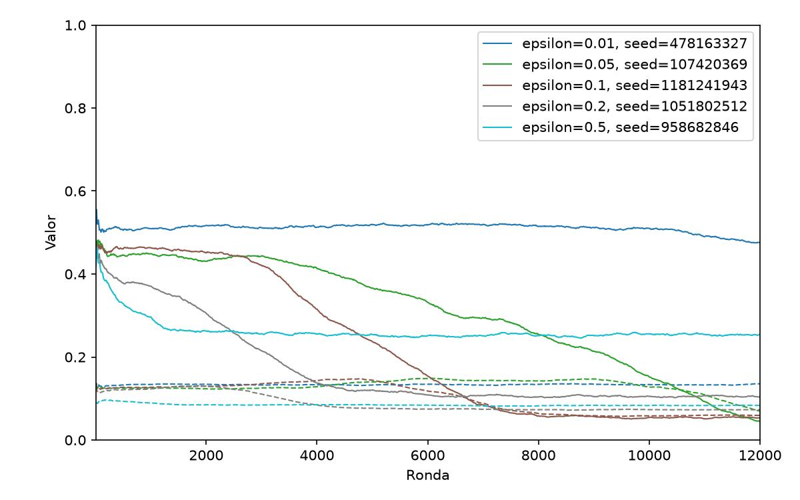
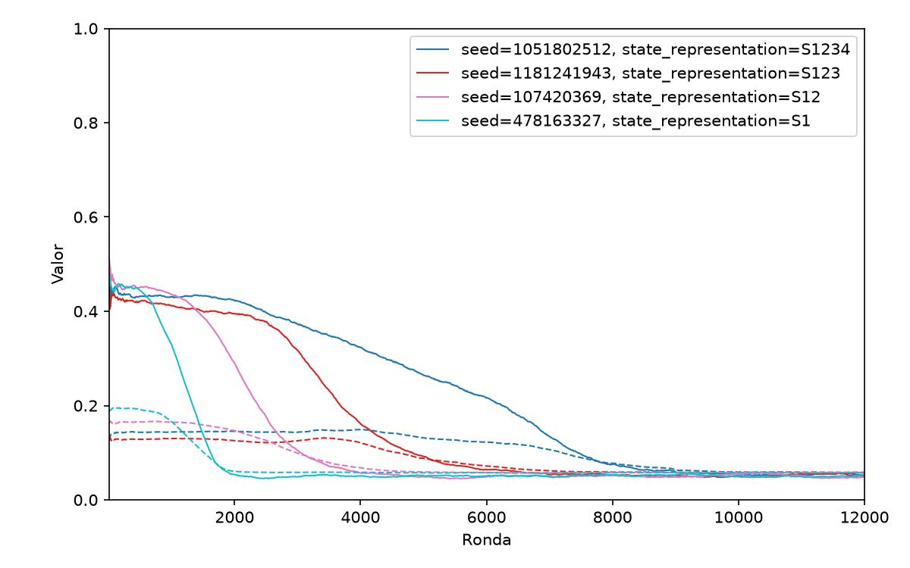

# Estudio del aprendizaje de cooperación en el Dilema del Prisionero multiagente

## Informe Final

**Alumno:** Adriano Fabris — **Código:** QOOPERATE

---

## 1. Introducción

El problema de la cooperación entre individuos que persiguen su propio interés, sin que exista una autoridad central
que los obligue a coordinarse, es uno de los problemas clásicos de la teoría de juegos. El Dilema del Prisionero
Iterado (IPD) es el modelo formal más usado para estudiarlo: dos jugadores eligen repetidamente entre cooperar (`C`)
o desertar (`D`), y la estructura de pagos hace que desertar sea la mejor respuesta a corto plazo aunque la
cooperación mutua produzca, en conjunto, un resultado mejor. Robert Axelrod estudió este problema mediante torneos
computacionales de estrategias y mostró que la reciprocidad —responder a lo que hizo el oponente— puede sostener la
cooperación cuando el juego se repite lo suficiente.

Este proyecto traslada ese problema a una población de agentes conectados por una red, que juegan el IPD con sus
vecinos y aprenden su comportamiento mediante Q-Learning en lugar de seguir una estrategia fija. A
diferencia de los torneos de Axelrod, aquí nadie programa una estrategia: el agente construye, ronda a ronda, una
tabla de valores $Q (s,a)$ a partir de lo que efectivamente le pasó, donde $s$ resume información de su vecindario.

La primera etapa del proyecto tuvo como objetivo encontrar *condiciones bajo las cuales emergiera
cooperación*. Todos los experimentos de esa etapa dieron el mismo resultado cualitativo: la población converge hacia
la deserción. Esto motivó una segunda etapa: en lugar de buscar tales condiciones nos preguntamos *cómo aprende el
agente lo que termina haciendo*, usando la diferencia
$\Delta Q (s) = Q (s,C) - Q (s,D)$ y la frecuencia de visita $F (s)$ de cada estado a lo largo del entrenamiento.

El resto del informe se organiza así: la Sección 2 repasa el marco teórico necesario, con énfasis en la comparación
entre
la información que disponible de una estrategia del torneo original y la que usa nuestro agente. La Sección 3 describe
el sistema, las métricas y el
diseño de los cinco experimentos (E1–E5). La Sección 4 analiza los resultados, priorizando la evolución temporal del
aprendizaje —qué estados importan en cada etapa, cuándo se separa $\Delta Q$ de $F$, qué es esperable y qué no— sobre
los valores finales. La Sección 5 cierra con las conclusiones y las limitaciones del diseño experimental.

---

## 2. Marco teórico

### 2.1. Dilema del Prisionero y su versión iterada

En el Dilema del Prisionero de una jugada, cada jugador elige `C` o `D` y los pagos cumplen

$$
T > R > P > S, \qquad 2R > T+S,
$$

con la matriz canónica usada en el proyecto: $T=5$ (tentación), $R=3$ (recompensa mutua), $P=1$ (castigo mutuo),
$S=0$ (pago del cooperador explotado). Desertar domina individualmente a cooperar sea cual sea la acción del otro
jugador, pero la deserción mutua $P$ es peor para ambos que la cooperación mutua $R$. Cuando el juego se repite (como en
el caso de un IPD), la acción de hoy puede condicionar la respuesta del otro mañana, y ahí aparece el espacio para la
reciprocidad.

Axelrod organizó torneos computacionales de estrategias para el IPD y encontró que la estrategia TIT FOR TAT —cooperar
en la
primera ronda y después repetir la última acción del oponente— ganó ambas rondas del torneo pese a competir contra
reglas mucho más sofisticadas. El resultado no se debe a que TIT FOR TAT "gane" cada partida individual (de hecho
nunca obtiene más puntos que su oponente en una partida dada), sino a que es *nice* (nunca deserta primero),
*provocable* (responde a una deserción) y *forgiving* (no queda anclada en un castigo indefinido).

### 2.2. Condiciones de estabilidad: ¿qué hace falta para que la cooperación se sostenga?

Dos resultados de Axelrod son especialmente relevantes para este proyecto.

Para entender las Proposiciones 5 y 6 es necesario introducir dos conceptos, el de una población ALL D, y el de
invasión:

- ALL D: dícese de una población en la que todos sus individuos desertan. Esta población tiene un beneficio típico $P$.

- Invasión: una población (invasora) puede *invadir* a una población (invadida) si la pobación invasora obtiene
  beneficio mayor que el típico de la población invadida.

**Proposición 5 (ALL D no es invadible por una población compuesta por un sólo individuo).** Ningún individuo aislado
puede invadir a ALL D, ya que cooperar en ese entorno da $S$, desertar da $P$, y $P>S$.

**Proposición 6 (ALL D es invadible por una población discriminante).** Lo que sí puede invadir ALL D es un grupo de
agentes que usan una
estrategia *maximally discriminating*: coopera con su propio tipo y dejan de cooperar con quien no tiene una actitud
recíproca. Para esto la estrategia necesita distinguir *con quién* está jugando y *qué hizo antes*.

En resumen, para que tenga lugar una invasión de una población cooperativa sobre otra, esta primera debe poder
*discriminar* con quién está interactuando y cuál fue el historial de la interacción, esto con el fin de poder aplicar
reciprocidad con los propios, y no con los ajenos. Tales condiciones, como veremos durante el desarrollo de los
experimentos y resultados de la primera etapa de este trabajo, no fueron satisfechas.

### 2.3. Q-Learning

El agente actualiza su tabla $Q (s, a)$ con la regla

$$
Q (s,a) \leftarrow Q (s,a) + \alpha\big[r + \gamma\max_{a'}Q (s',a') - Q (s,a)\big],
$$

donde $\alpha$ es la tasa de aprendizaje, $\gamma$ el factor de descuento, $r$ la recompensa inmediata y $(s, a)$ el par
estado-acción.

El agente selecciona acciones con una política $\epsilon$-greedy: explora con probabilidad $\epsilon$, y en caso
contrario
elige $\arg\max_a Q (s,a)$. La medida $\Delta Q (s) = Q (s,C)-Q (s,D)$ resume qué acción prefiere el agente
en cada estado: negativa favorece `D`, positiva favorece `C`.

### 2.4. Aprendizaje multiagente no estacionario

Cuando todos los agentes aprenden a la vez, cada uno modifica el entorno de los demás: la política de un vecino en la
ronda $t$ no es la misma que en $t+1000$. Esto rompe los supuestos habituales de convergencia de Q-Learning para un
único agente en un entorno fijo. Por eso el proyecto no busca una política óptima sino encontrar los patrones para la
emergencia de ciertos comportamientos.

### 2.5. Estados, ¿fue suficiente la información del agente para lograr esa reciprocidad?

El estado $s$ de cada agente se arma con los siguientes cuatro subestados:

* $s_1$: acción mayoritaria del vecindario en la ronda anterior,
* $s_2$: última acción propia,
* $s_3$: tasa de cooperación del vecindario,
* $s_4$: recompensa media reciente propia.

Nótese que ninguna de estas variables identifica a un vecino en particular ni conserva su historial individual. $s_1$
y $s_3$
son *promedios* del vecindario completo; $s_2$ y $s_4$ son propiedades del propio agente, no del oponente. Esto
importa porque las estrategias discriminantes no necesitan saber "cuánta gente coopera alrededor", necesita saber "qué
hizo *este*
vecino la vez pasada" para poder recompensarlo o castigarlo específicamente.

---

## 3. Diseño experimental

### 3.1. El sistema

Este proyecto simula $N$ agentes sobre un grafo. En cada ronda:

1. cada agente calcula su estado a partir del historial de la ronda anterior,
2. elige acción con $\epsilon$-greedy,
3. juega el IPD con cada vecino y promedia el pago,
4. calcula el estado siguiente y
5. actualiza $Q$.

Como es posible notar, no hay una fase de entrenamiento separada de una fase de ejecución, se aprende y se actúa al
mismo tiempo.

### 3.2. Métricas

A nivel colectivo se mide la tasa de cooperación $C_t$ y el índice de Gini $G$ de las recompensas. A nivel del
aprendizaje interno se registra, en checkpoints de la simulación, para cada uno de los
estados posibles:

* $F (s) = V (s)/\sum_{s'} V (s')$: frecuencia relativa de visitas al estado, para ver la importancia de cada estado
* $\Delta Q (s) = Q (s,C)-Q (s,D)$: qué acción prefiere el agente en ese estado
* $P (s) = \Delta Q (s)\cdot F (s)$: pondera la preferencia por la frecuencia con que efectivamente se visita el estado

### 3.3. Sobre la información contenida en los logs

Cada corrida registra tres checkpoints, correspondientes al 33 %, 67 % y 100 % de las rondas
simuladas. Los archivos no
incluyen el número de ronda absoluto, solo la etiqueta porcentual, por lo que podemos hablar de puntos tempranos,
intermedios y tardíos de cada corrida, además, a priori no podemos asumir que último checkpoint (el del 100 %) indique
un estado estacionario, sin embargo, debido a las proposiciones previamente explicadas, los resultados de los
experimentos no distaron de serlo.

### 3.4. Representación del estado

A excepción del experimento E5, todos los demás tienen exactamente $2\times2\times3\times3=36$ estados. La
interpretación de cada
estado (con base en sus subestados) es la siguiente:
a

En la siguiente figura podemos visualizar los mapas de calor de $\Delta Q (s)$ y $F (s)$ junto con la descripción
específica de uno de los estados para el checkpoint correspondiente al 100 %:

El estado $(1,1,0,0)$ es el estado que va a dominar buena parte del análisis de los resultados.

En E5 se investiga específicamente cómo una reducción en la representación de estados a subconjuntos
de $s_1,s_2,s_3,s_4$ afecta el comportamiento:

- $s_{1}$ usa $s_1$ (2 estados),
- $s_{12}$ usa $s_1$ y $s_2$ (4 estados),
- $s_{123}$ usa $s_1$, $s_2$ y $s_3$ (12 estados), y
- $s_{1234}$ usa $s_1$, $s_2$, $s_3$ y $s_4$ (los 36 estados).

### 3.5. Experimentos

Todos parten de la configuración de calibración E0 (red Watts-Strogatz, $k=8$, $\gamma=0.9$, $\rho=1$, $N=100$,
representación $s_{1234}$) y modifican una única dimensión por vez:

| Experimento | Variable                         | Valores analizados                       |
|-------------|----------------------------------|------------------------------------------|
| E1          | Topología                        | Lattice, Watts-Strogatz, Erdős-Rényi     |
| E2          | Tasa de aprendizaje $\alpha$     | 0.1, 0.2, 0.5                            |
| E3          | Exploración $\epsilon$           | 0.05, 0.1, 0.2, 0.5                      |
| E4          | Profundidad de vecindario $\rho$ | 1, 2, 4                                  |
| E5          | Representación del estado $s$    | $s_{1}$, $s_{12}$, $s_{123}$, $s_{1234}$ |

En la siguiente figura podemos distinguir la naturaleza de las conexiones en cada topología, de izquierda a derecha: la
red disminuye su nivel de clusterización reconectando las aristas aleatoriamente. En un principio, la elección de
utilizar varias topologías estuvo motivada para analizar cómo esos niveles de segmentación y agrupamiento podían o no
derivar en comportamientos cooperativos.

---

## 4. Análisis de resultados

En E1, E2 y E4 el resultado cualitativo es el mismo en todas las variantes: el estado dominante al final es $(1,1,0,0)$
(vecindario desertor, autor desertando) con $\Delta Q$ negativo, lo que cambia entre configuraciones es la velocidad con
la que se llega hasta ahí.

En **E1 (topología)**, Lattice, Watts-Strogatz y Erdős-Rényi convergen los tres a $(1,1,0,0)$ con $F$ entre 0.55 y 0.57
al 100 % y $\Delta Q$ entre $-0.9$ y $-1.0$. Esperable ya que $s_1$ y $s_3$ son promedios del vecindario y las tres
redes comparten el mismo grado medio $k=8$, así que el agente no percibe diferencias en las estructuras más allá de ese
factor.

En **E2 (aprendizaje $\alpha$)**, a mayor $\alpha$ la concentración en $(1,1,0,0)$ es más rápida (con $\alpha=0.5$ ya
domina en el primer checkpoint, con $\alpha=0.1$ recién al final), pero la dirección aprendida es la misma en los tres
casos. $\alpha$ regula la velocidad de aprendizaje y no la dirección de convergencia.

El **E3 (exploración $\epsilon$)** es la excepción a esa monotonía: la concentración es máxima en $\epsilon=0.2$ ($F$
final 0.66) y cae tanto para $\epsilon=0.05$ ($F=0.28$) como para $\epsilon=0.5$ ($F=0.26$, y ahí ni
siquiera $(1,1,0,0)$ es el estado más visitado). La lectura más simple es que hay dos efectos en tensión: muy poca
exploración deja que las políticas iniciales —ruidosas— demoren la convergencia hacia el comportamiento no
cooperativo, y demasiada
exploración mantiene una fracción de acciones aleatorias que nunca deja de mezclar la distribución de estados, por más
rondas que pasen. $\epsilon=0.2$ es donde ese balance concentra más visitas en el horizonte observado.

En **E4 (vecindad $\rho$)**, aumentar la profundidad de vecindario también acelera la concentración $F (1,1,0,0)$ pasa
de 0.06/0.34/0.54 con $\rho=1$ a 0.24/0.60/0.71 con $\rho=4$), ya que promediar sobre más vecinos estabiliza $s_1$
y $s_3$ entre rondas. Pero sigue siendo más información de la misma naturaleza, así que tampoco cambia el resultado.

El **E5 (subrepresentaciones de $s$)** es el único experimento donde la variable manipulada cambia la naturaleza de lo
que
el
agente puede distinguir, no solo la cantidad de información espacial. Con $s_1$ el agente ni siquiera registra su propia
última acción, así que con dos estados posibles casi todo cae en "vecindario no cooperador" ($F=0.98$) de forma casi
mecánica.
A medida que se agregan $s_2$, $s_3$ y $s_4$ el espacio crece y el estado dominante concentra una fracción menor del
total (98 % → 86 % → 75 % → 52 %), pero en los cuatro casos ese estado dominante tiene $\Delta Q$ claramente negativo.

En casi todas las corridas con más de un checkpoint informativo, el $\Delta Q$ del estado que
termina dominando, $(1,1,0,0)$, ya es fuertemente negativo en el checkpoint temprano, cuando su $F$ todavía es baja.
Esto es
consistente con la estructura de pagos: contra un vecindario que ya deserta, la diferencia entre cooperar $S=0$ y
desertar $P=1$ es grande desde la primera vez que se visita el estado, así que separar $Q (s,C)$ de $Q (s,D)$ no
requiere muchas actualizaciones. Lo que sí toma tiempo es que la población entera converja al comportamiento que hace de
ese estado el más frecuente, aunque ese tiempo se vea fácilmente modificable mediante $\alpha$ o $\rho$.

---

## 5. Conclusiones

Bajo las cinco variaciones estudiadas, la población converge de forma robusta al estado $(1,1,0,0)$ con $\Delta Q$
negativo. Topología, $\alpha$, $\rho$ y (con la excepción no monótona de $\epsilon$) la exploración modifican solo la
velocidad de esa convergencia; la representación del estado modifica cuánta granularidad tiene el agente sobre su propia
situación, pero en ningún caso el signo de la preferencia cambia.

Interpretado con el marco de Axelrod, esto es coherente con la Proposición 5 (ALL D es colectivamente estable) y
explicable por la Proposición 6: invadir esa estabilidad requiere discriminar entre vecinos, y la representación de
estado usada —aun en su versión más rica, $s_{1234}$— agrega la información del vecindario en fracciones y promedios en
lugar de conservar historia por vecino. Ninguna de las variables manipuladas introduce ese mecanismo, así que es de
esperar que ninguna
cambia el resultado cualitativo.

**Trabajo
futuro.** El punto que se desprende del análisis es que, para estudiar si puede emerger cooperación en este sistema,
hace falta cambiar la naturaleza de la información disponible para el agente y no solo su cantidad: algo que le permita
condicionar su acción al historial específico de cada vecino (por ejemplo, un registro de acción-por-vecino en vez de
una fracción agregada), que es precisamente lo que la Proposición 6 señala como necesario para que una estrategia
discriminante pueda invadir una población de desertores.
---

## Bibliografía

[1] Axelrod, R. (1984). *The Evolution of Cooperation*. Basic Books.

[2] Brunton, S. & Kutz, J. (2019). *Data-Driven Science and Engineering: Machine Learning, Dynamical Systems, and
Control*.

[3] Russell, S., & Norvig, P. (2020). *Artificial Intelligence: A Modern Approach (4th ed.)*. Pearson.

**Recursos del repositorio:** `/archive/anteproyecto.md` — definición inicial del proyecto.

---

